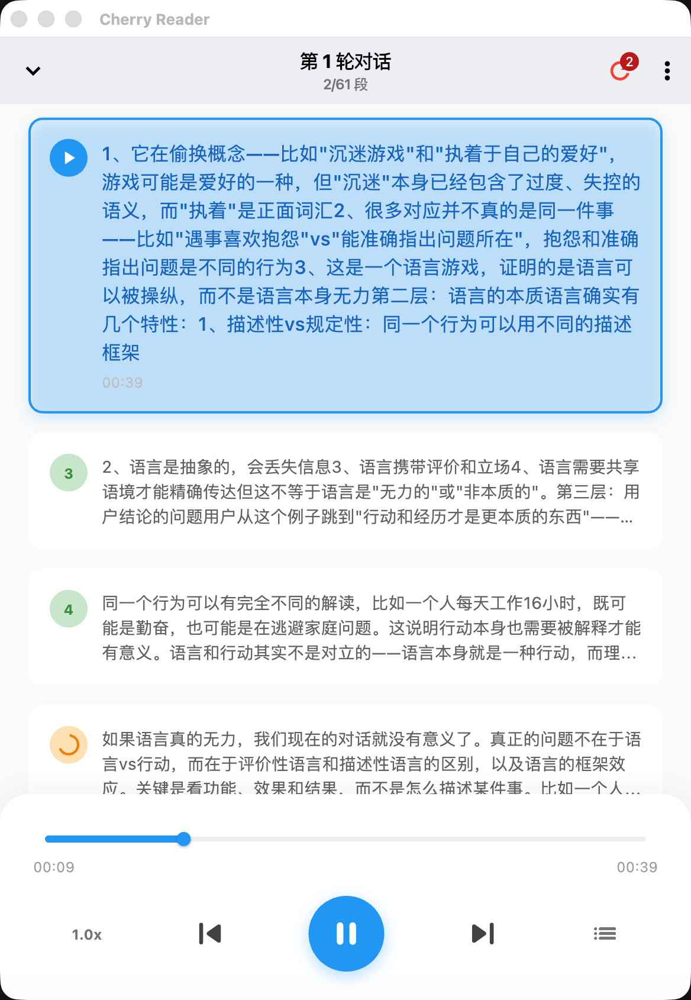
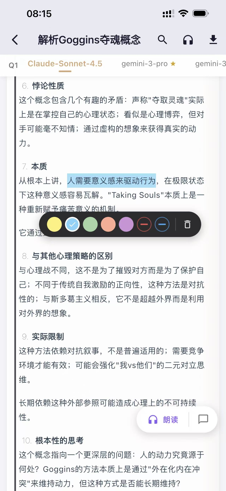

<div align="center">


# Cherry Reader

**让 AI 对话成为可积累的知识资产**

Cherry Studio 对话的阅读、标注、洞察与知识管理工具

[](https://opensource.org/licenses/MIT)
[](https://flutter.dev/)

</div>

---

## 为什么需要 Cherry Reader？

你每天和 AI 进行大量对话——讨论想法、解决问题、学习新知。但这些对话往往“用完即弃”，很少被回顾。

Cherry Reader 让这些对话变成可搜索、可标注、可分析的知识库。

---

## 核心功能

### 💡 AI 洞察

用 AI 分析你的历史对话，发现思维模式与成长轨迹。

- **多种分析视角** — 复盘整理、自我觉察、思维决策、大师视角（查理·芒格、亚里士多德...）
- **灵活筛选** — 按助手、时间范围选择要分析的对话
- **流式输出** — 实时查看分析结果，支持历史洞察回顾

### 📖 沉浸阅读

把 AI 对话当作文章来阅读。

- **TTS 语音朗读** — Azure 语音，边走边听，支持倍速调节
- **EPUB 导出** — 导出到 Kindle、Books 等阅读器

### ✨ 高亮标注

标记重要内容，不让洞见淹没在对话流中。

- 5 种颜色分类标记
- 本地持久化存储
- 一键查看所有标注

### 🤖 多模型对比

Cherry Studio 支持 `@提及` 多模型同时回答，Cherry Reader 让你更好地对比它们。

- **并排展示** — 多模型回答左右对照
- **AI 共识分析** — 自动提取共识点与分歧点
- **主线标识** — 金色边框标记你选择保留的回答

### 💬 讨论挂载

在任意 AI 回复下开启独立讨论，深入探索某个观点，不污染原对话上下文。

### 🔌 MCP Server（桌面端）

让 Cursor、Claude Code 等 AI 编程助手访问你的聊天记录。

```bash
# Claude Code 一键添加
claude mcp add --transport http cherry-reader http://localhost:9527/mcp
```

提供的工具：
- `recall_my_conversations` — 回顾某段时间的对话
- `search_past_discussions` — 语义/关键词搜索历史
- `read_conversation_detail` — 读取完整对话

---

## 截图

<div align="center">
<table>
  <tr>
    <td></td>
    <td></td>
<td></td>
  </tr>
  <tr>
    <td align="center">AI 洞察</td>
    <td align="center">朗读</td>
    <td align="center">高亮标注</td>
  </tr>
</table>
</div>

---

## 适合谁？

- 🧠 把 AI 当作思考伙伴的人
- 📚 希望从过去的对话中提取洞见
- 🔄 喜欢复盘反思的终身学习者
- 📝 用 AI 辅助写作、研究、学习的知识工作者

---

<div align="center">

**Cherry Reader** — 你的 AI 对话值得被记住

[GitHub](https://github.com/ifastcc/cherry-reader) · [Releases](https://github.com/ifastcc/cherry-reader/releases) · [Issues](https://github.com/ifastcc/cherry-reader/issues)

</div>
